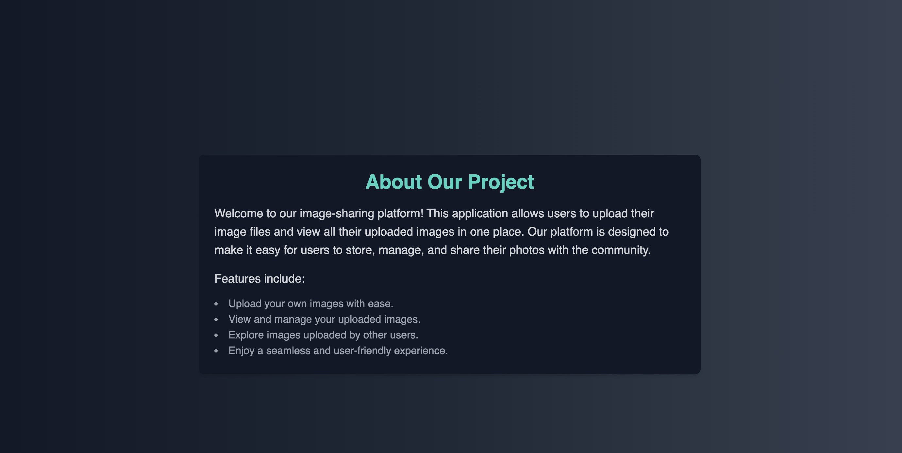

# searchImage

## Overview

searchImage is a full-stack MERN-based application that allows users to upload, manage, and search for images efficiently. The application utilizes various technologies for enhanced performance and user experience.


## Features

- **Environment Variables**: Sensitive information such as API keys and database credentials are stored in a `.env` file.
- **Search Functionality**:

  - Supports **partial search** to find images based on keywords.
  - Handles **faulty searches** gracefully, providing relevant results even with typos.
  - Uses **MongoDB text indexing** for optimized search results.

- **Image Management**: Users can upload and delete their own photos.
- **Cloudinary Integration**: Large files are stored on Cloudinary, ensuring scalability and performance.

## Technologies Used

- **Frontend**: React.js
- **Backend**: Express.js
- **Database**: MongoDB
- **Caching**: Redis
- **File Storage**: Cloudinary

## Installation

1. Clone the repository:
   ```bash
   git clone https://github.com/yourusername/searchImage.git
   cd searchImage
   ```
